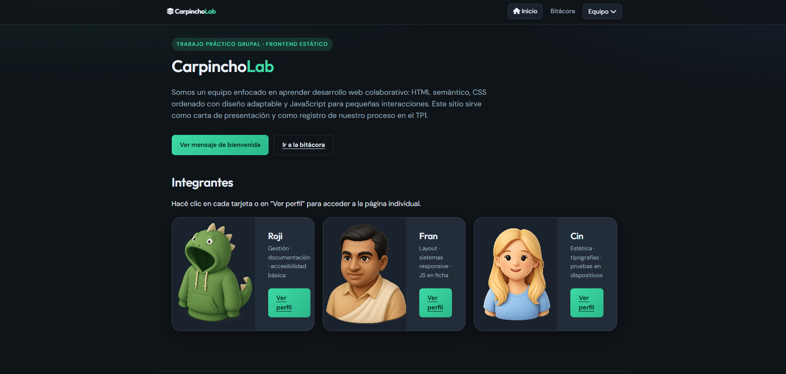
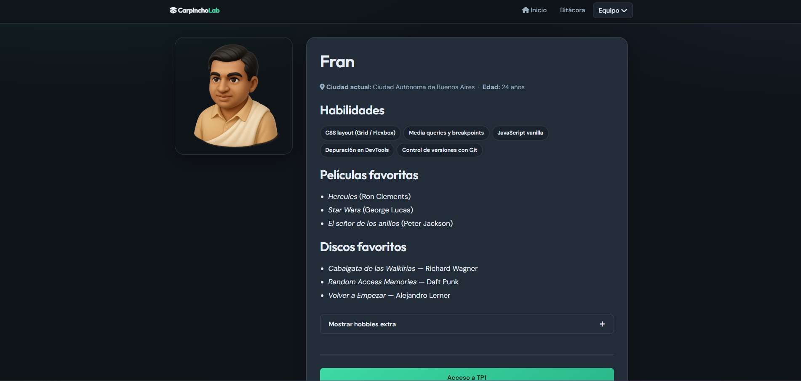

# CarpinchoLab · TP1 Frontend


**Nombre del equipo / proyecto:** CarpinchoLab  

**Deploy en producción:** https://carpincho-lab.vercel.app/

---

## Descripción del proyecto

Sitio web estático multipágina para cumplir el TP1 Grupal de Frontend: presentación del equipo CarpinchoLab, tarjetas individuales con datos obligatorios (foto, nombre, ubicación, edad, habilidades, películas y discos favoritos), sección **Bitácora** con el proceso del trabajo y navegación explícita con botones y menú principal en todas las secciones. Incluye estilos responsivos para los breakpoints solicitados (**400px**, **900px**, **1200px**), tipografías desde **Google Fonts**, iconos con **Font Awesome** y comportamiento dinámico con **JavaScript** en portada y en cada perfil.

---

## Integrantes

| Integrante           | Rol sugerido (editable)           | Vercel |
|----------------------|-----------------------------------|--------|
| Roji                | Documentación · accesibilidad     | https://roji-web-ok.vercel.app/ |
| Fran                 | Responsive · CSS · JS             | https://tp-frontend-wine.vercel.app/|
| Cin                  | Estética · pruebas en móvil       | https://mi-portfolio-three-gamma.vercel.app/ |

> **Importante:** reemplazá `TU-USUARIO-*` por los perfiles reales de cada integrante.

---

## Tecnologías utilizadas

- HTML5 semántico (páginas en la raíz del repositorio)
- CSS3 (variables, Flexbox, Grid, media queries)
- JavaScript (vanilla, sin frameworks)
- [Google Fonts — DM Sans y Outfit](https://fonts.google.com/share?selection.family=DM+Sans:ital,wght@0,400;0,500;0,700;1,400%7COutfit:wght@500;600;700)
- [Font Awesome 6](https://fontawesome.com/) (CDN)
- Git y GitHub (repositorio del proyecto)
- Vercel (publicación estática)

---

## Estructura de archivos

```
TP1_Frontend/
├── index.html              # Portada
├── bitacora.html           # Bitácora de proceso
├── perfil-roji.html
├── perfil-fran.html
├── perfil-cin.html
├── css/
│   └── styles.css          # Estilos globales y responsive
├── js/
│   ├── nav.js              # Menú “Equipo” (todas las páginas)
│   ├── page-intro.js       # Pantalla de entrada con imagen (solo portada)
│   ├── index.js            # Interacción en portada
│   ├── perfil-roji.js
│   ├── perfil-fran.js
│   └── perfil-cin.js
├── img/
│   ├── Rocio.png           # foto de Roji en portada/perfil (ajustá nombre si cambia)
│   ├── Fran.png            # foto de Fran en portada/perfil
│   ├── carpincho-entrada.png # imagen de la entrada inicial (portada)
│   ├── Cintia.png           # foto de Cin en portada/perfil
│   └── readme/             # Capturas para este README (ver abajo)
└── README.md
```

---

## Guía de estilos

### Paleta de colores (hex)

| Uso | Hex |
|-----|-----|
| Fondo principal | `#0f1419` |
| Fondo elevado / tarjetas | `#1a222d` → `#232d3a` |
| Texto principal | `#e8eef5` |
| Texto secundario | `#9aaebf` |
| Acento | `#3dd9a5` |
| Bordes suaves | `rgba(232, 238, 245, 0.12)` |

### Tipografías (Google Fonts)

- **Títulos:** [Outfit](https://fonts.google.com/specimen/Outfit) — pesos 500–700.
- **Cuerpo:** [DM Sans](https://fonts.google.com/specimen/DM+Sans) — pesos 400–700 e itálica.

### Iconografía

- **Font Awesome 6** vía CDN (iconos de navegación y metadatos en perfiles).
- **Avatares:** ilustraciones vectoriales **SVG** propias (no fotos personales reales), en línea con la recomendación de privacidad de la consigna.

---

## JavaScript — funciones dinámicas

| Ubicación | Archivo | Qué hace |
|-----------|---------|----------|
| Todas las páginas | `js/nav.js` | Abre/cierra el submenú “Equipo” y cierra al hacer clic fuera; actualiza `aria-expanded`. |
| Portada (`index.html`) | `js/page-intro.js` | Muestra una entrada con imagen (`img/carpincho-entrada.png`): animación de aparición y salida por tiempo (~2 s), clic para saltar o **Escape**. No se ejecuta si el usuario tiene `prefers-reduced-motion: reduce`. |
| Portada (`index.html`) | `js/index.js` | Alterna visibilidad del panel de mensaje de bienvenida al pulsar el botón. |
| `perfil-roji.html` | `js/perfil-roji.js` | Muestra u oculta el bloque de “hobbies extra” con el botón correspondiente. |
| `perfil-fran.html` | `js/perfil-fran.js` | Muestra u oculta el bloque de “hobbies extra” con el botón correspondiente. |
| `perfil-cin.html` | `js/perfil-cin.js` | Muestra u oculta el bloque de “hobbies extra” con el botón correspondiente. |

### Capturas de pantalla

Colocá las capturas en `img/readme/` y mantené los nombres para que el README las muestre correctamente:

1. Tras publicar en Vercel, abrí el sitio y capturá **portada**, **bitácora** y **un perfil**.
2. Guardá los archivos como:

   - `img/readme/captura-portada.png`
   - `img/readme/captura-bitacora.png`
   - `img/readme/captura-perfil.png`

3. Descomentá o agregá las líneas siguientes (si usás GitHub, las imágenes se verán en el repositorio):






*Nota: hasta que no existan esos archivos, las imágenes anteriores aparecerán rotas; generá las capturas tras el deploy.*

---

## Enlace al proyecto desplegado

- **Vercel:** https://carpincho-lab.vercel.app/index.html

---

## Uso de inteligencia artificial

**Herramientas:** indicar las usadas por el equipo (ej.: ChatGPT, Copilot, Gemini, Cursor, etc.) y el modelo aproximado si aplica.

**Contenido y código:** describir en qué partes la IA ayudó (borradores de textos de bitácora, sugerencias de estructura HTML, depuración de CSS/JS, etc.) y qué revisión humana hicieron antes de entregar.

**Imágenes:** los avatares son **SVG simples** hechos a mano en este repositorio (formas geométricas). Si en el futuro usan imágenes generadas por IA, documenten **herramienta/modelo** y **criterio de prompt** aquí.

---
