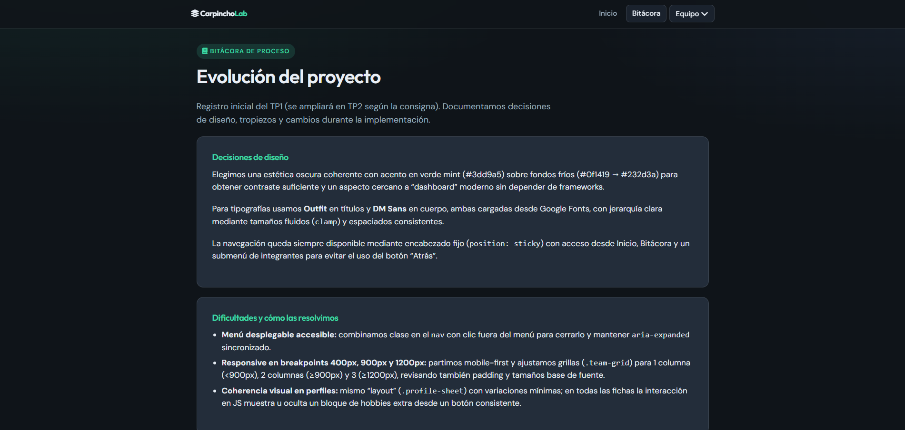

# CarpinchoLab · TP2 Frontend (React)


**Nombre del equipo / proyecto:** CarpinchoLab  

**Deploy en producción (Vercel):** https://carpincho-lab.vercel.app/

---

## Descripción

SPA en **React** que evoluciona el TP1 estático (HTML/CSS/JS) hacia una arquitectura de componentes con **React Router**. Incluye dashboard con **sidebar fija**, grilla animada de integrantes, perfiles profesionales con barras de habilidades, carrusel de proyectos y redes sociales, **explorador JSON** con filtrado en tiempo real, consumo de **API externa** con paginación, **galería con lightbox**, **bitácora** del proceso y **árbol de renderizado** de la arquitectura. Diseño responsive y despliegue en Vercel.

---

## Integrantes

| Integrante | Apellido | Rol en TP2 | GitHub | TP1 individual |
|------------|----------|------------|--------|----------------|
| Rocío (Roji) | — | Documentación · accesibilidad | [github.com/TU-USUARIO-roji](https://github.com/) | [roji-web-ok.vercel.app](https://roji-web-ok.vercel.app/) |
| Francisco (Fran) | — | React · API · CSS dashboard | [github.com/TU-USUARIO-fran](https://github.com/) | [tp-frontend-wine.vercel.app](https://tp-frontend-wine.vercel.app/) |
| Cintia (Cin) | — | Estética · galería · pruebas móvil | [github.com/TU-USUARIO-cin](https://github.com/) | [mi-portfolio-three-gamma.vercel.app](https://mi-portfolio-three-gamma.vercel.app/) |

> **Importante:** reemplazá los links `TU-USUARIO-*` por los perfiles reales de GitHub de cada integrante antes de la entrega final.

---

## Tecnologías utilizadas

| Recurso | Uso |
|---------|-----|
| [React 19](https://react.dev/) | UI por componentes, hooks, estado local |
| [React Router 7](https://reactrouter.com/) | Rutas SPA, layout anidado, perfiles dinámicos |
| [Vite 6](https://vite.dev/) | Dev server y build de producción |
| HTML5 semántico | Estructura accesible en JSX |
| CSS3 | Variables, Grid, Flexbox, animaciones, media queries |
| [Google Fonts — DM Sans y Outfit](https://fonts.google.com/share?selection.family=DM+Sans:ital,wght@0,400;0,500;0,700;1,400%7COutfit:wght@500;600;700) | Tipografías |
| [Font Awesome 6](https://fontawesome.com/) | Iconografía (CDN) |
| [JSONPlaceholder](https://jsonplaceholder.typicode.com/) | API pública para el módulo de posts |
| Git / GitHub | Control de versiones |
| Vercel | Hosting de la SPA |

---

## Estructura de archivos

```
CarpinchoLab/
├── index.html                 # Entrada Vite
├── package.json
├── vite.config.js
├── vercel.json                # Rewrites SPA
├── public/
│   └── img/                   # Avatares, mascota, capturas README
├── src/
│   ├── main.jsx               # Montaje React + BrowserRouter
│   ├── App.jsx                # Definición de rutas
│   ├── styles/
│   │   └── global.css         # Variables, tipografía, utilidades
│   ├── components/
│   │   ├── layout/            # DashboardLayout, Sidebar
│   │   ├── home/              # MemberCard
│   │   ├── profile/           # SkillBar, ProjectCarousel, TechStack…
│   │   └── gallery/           # Lightbox
│   ├── pages/                 # Home, Profile, Explorador, API, Galería…
│   └── data/                  # members.js, localCatalog.json, galleryImages.js
├── legacy/                    # TP1 original (HTML/CSS/JS) — referencia
│   ├── index.html
│   ├── bitacora.html
│   ├── perfil-*.html
│   ├── css/
│   └── js/
└── README.md
```

---

## Guía de estilos

### Paleta de colores (hex)

| Uso | Hex |
|-----|-----|
| Fondo principal | `#0f1419` |
| Fondo elevado / tarjetas | `#1a222d` → `#232d3a` |
| Texto principal | `#e8eef5` |
| Texto secundario | `#9aaebf` |
| Acento | `#3dd9a5` |
| Bordes suaves | `rgba(232, 238, 245, 0.12)` |

### Tipografías (Google Fonts)

- **Títulos:** [Outfit](https://fonts.google.com/specimen/Outfit) — pesos 500–700.
- **Cuerpo:** [DM Sans](https://fonts.google.com/specimen/DM+Sans) — pesos 400–700 e itálica.

### Iconografía

- **Font Awesome 6** vía CDN (sidebar, perfiles, tech stack, paginación).
- **Avatares:** imágenes PNG del equipo en `public/img/` (generadas/asistidas por IA según sección abajo).

---

## JavaScript / React — funciones dinámicas y componentes clave

| Sección | Componentes / lógica | Qué hace |
|---------|----------------------|----------|
| **Dashboard Home** | `HomePage`, `MemberCard` | Grilla de tarjetas con animación `fadeSlideUp` escalonada; link a perfil vía Router. |
| **Sidebar** | `Sidebar`, `DashboardLayout` | Navegación fija jerárquica: secciones + submenú Equipo. |
| **Perfil** | `ProfilePage`, `SkillBar`, `ProjectCarousel`, `TechStack`, `SocialLinks` | Barras animadas al entrar en viewport; carrusel manual; ≥5 iconos con hover; botones sociales con escala/color. |
| **Explorador JSON** | `DataExplorerPage`, `localCatalog.json` | 20 objetos; filtro por texto + categoría con `useMemo` en tiempo real. |
| **API externa** | `ApiPage` | `fetch` async a JSONPlaceholder; estados loading/error; paginación Anterior/Siguiente e indicador de página. |
| **Galería** | `GalleryPage`, `Lightbox` | Grid clickeable; modal con zoom hover, flechas y **ESC** para cerrar. |
| **Bitácora** | `BitacoraPage` | Roles, GitFlow/Trello, justificación migración TP1→TP2. |
| **Árbol** | `ComponentTreePage` | Diagrama ASCII del árbol de renderizado desde `App` hasta componentes hijos. |

### Capturas de pantalla

Colocá capturas en `public/img/readme/` (también accesibles en deploy):





*Generá capturas nuevas del TP2 React tras el deploy y reemplazá estos archivos si querés mostrar la UI actualizada.*

---

## Enlace al proyecto desplegado

- **Vercel (TP2 React):** https://carpincho-lab.vercel.app/
- **TP1 legacy (referencia):** archivos en carpeta `legacy/` del repositorio

---

## Evolución TP1 → TP2

| Aspecto | TP1 (legacy/) | TP2 (React) |
|---------|---------------|-------------|
| Arquitectura | HTML multipágina | SPA con componentes |
| Navegación | Header sticky + recarga | Sidebar fija + React Router |
| Estado | DOM + scripts sueltos | Hooks (`useState`, `useEffect`, `useMemo`) |
| Datos | Hardcode en HTML | `members.js`, JSON importado, API fetch |
| Interactividad | Toggle hobbies, intro | Carrusel, filtros, lightbox, paginación API |
| Deploy | Estático por archivo | Build Vite + rewrite SPA en Vercel |

El README del TP1 se amplió con esta sección, la nueva estructura `src/`, capturas del dashboard React y documentación de IA ampliada.

---

## Uso de inteligencia artificial

### Herramientas

| Herramienta | Uso en el proyecto |
|-------------|-------------------|
| **Cursor (Claude / Auto)** | Scaffold React, componentes, migración de contenido TP1, depuración de build Vite |
| **ChatGPT / Gemini** (equipo) | Borradores de textos de bitácora y descripciones de proyectos en perfiles |
| **Copilot** (opcional) | Autocompletado de JSX/CSS repetitivo |

### Contenido y código

- **Textos:** descripciones de bio, hobbies y entradas de la bitácora fueron revisadas y editadas por el equipo tras borradores asistidos por IA.
- **Código:** la IA ayudó a estructurar rutas, hook de paginación API, lightbox con teclado y organización de carpetas; el equipo validó nombres, estilos y accesibilidad antes de integrar.
- **Debugging:** resolución de conflictos al migrar desde HTML raíz a Vite (mover TP1 a `legacy/`).

### Imágenes

| Asset | Modelo / herramienta | Criterio de prompt |
|-------|----------------------|-------------------|
| Avatares (`Rocio.png`, `Fran.png`, `Cintia.png`) | IA generativa (indicar modelo usado por el equipo, ej. DALL·E / Midjourney) | Retratos ilustrados estilo vector/3D suave, fondo oscuro, acento verde mint, sin datos personales reales |
| Mascota (`carpincho-entrada.png`) | IA generativa | Carpincho simpático tipo mascota tech/lab, tema espacial o laboratorio, coherente con marca CarpinchoLab |

> Se evalúa integrar la IA como asistente manteniendo **autoría humana**: decisiones de UX, paleta, rutas y revisión final son del equipo.

---

## Cómo ejecutar en local

```bash
npm install
npm run dev
```

Build de producción:

```bash
npm run build
npm run preview
```

---

## Checklist de consigna TP2

- [x] Sidebar fija estilo dashboard con logo y menú jerárquico (React Router)
- [x] Dashboard home con grilla de tarjetas, avatar y animaciones de entrada
- [x] Perfiles con barras de habilidades, carrusel (≥3 proyectos), tech stack (≥5 iconos), redes con hover
- [x] JSON local (20 ítems) + buscador y filtro en tiempo real
- [x] API pública async con loading, error y paginación
- [x] Galería grid + lightbox (zoom, navegación, ESC)
- [x] Bitácora (roles, GitFlow/Trello, migración)
- [x] Árbol de renderizado documentado
- [x] README completo con links, capturas y sección IA
- [ ] Reemplazar links de GitHub reales de integrantes
- [ ] Actualizar capturas de pantalla del TP2 desplegado
